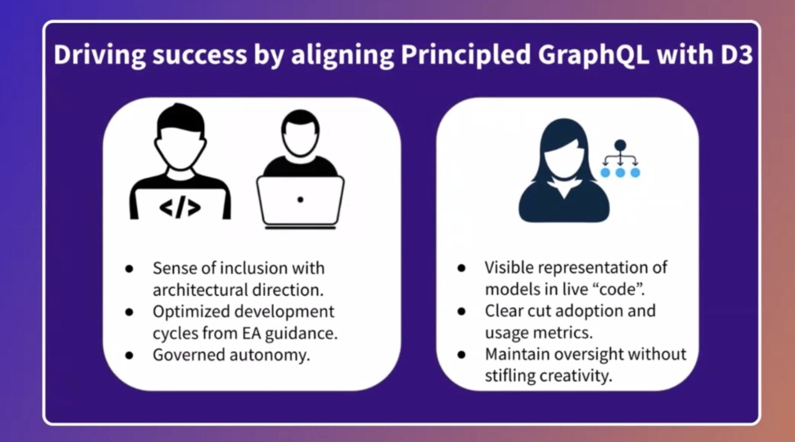

## GraphQL for the enterprise
- How do we ensure teams are collaborating as best as possible
- How do we provide productivity tools
- How do we ensure people are not stepping on each others toes

## Principles GraphQL and Demand Oriented Design
- **Demand driven**
  - another commit
  - When I am establishing the types and fields that are made available, those are based on demand based systems
  - I will gather only what I need approach
- **Domain driven design**
  -  Establishing a common level of understanding across teams
    - Commonality and understanding of what things are (domains and subdomains) -- logical entities
  - **Bounded Context** -- what infrastructure/systems support what domain
  - Consumers: Here is the data we need for our new apps
  - Producers: Here is the data we have
  - All constructs are business centric! -- this is the common ground
    - Classification of canonical business centric constructs and logic
- How to align entire enterprise for rapid innovation?
  - Dev Team 1
    - Graph steward 1
  - Dev Team 2
    - Graph steward 2
  - In order to marry domain driven <> demand driven
    - Enterprise architects will be part of the Graph Stewards group
    - When trying to figure out where the boundaries of the subgraph is, EAs work with Graph Stewards to define that
  - EAs create guidance, best practices and recommendations for a good architecture
  - Help avoid developers going wild west

- Find a sweet spot between domain and demand driven design patterns

---
# FAQs

## Authn/Authz
- Layers of authn and authz --> Before hitting the supergraph, before hitting the subgraph and before hitting the backend services
- Backend services own the majority of the authorization as its native to those systems

## Subgraph dependencies
- A unified schema has capabilities of query optimization, caching results etc already present in federation
- Try not to chain requests if possible by maybe redesigning the graph

## Domain driven with REST --> GraphQL
- Not going to deploy and create 15 subgraphs out of the gate
- Pick the most important ones (traffic, revenue)
- Iterate overtime and create more subgraphs

## Federated Graph vs Data Mesh
- GraphQL is consumer centric vs data mesh is more data centric, but there is overlap in general in terms of unified data access

## How do we avoid subgraphs from depending on each other
- There is some level of autonomy between services, if I am waiting for service A to resolve something from service B, then maybe an aggregated layer might be useful
- But, in general extend types can be used with federation

## Ownership of gateway??
- How many subgraphs vs how many unified schemas
- Many organizations pursue a single unified schema (north star)
- So a single owner of a single gateway

## How to migrate from monolithic graph to subgraphs
- There are best practices how to spin things off
- Core of everything is subgraph 1 and new requirements are subgraph 2
- Migrate out of one overtime