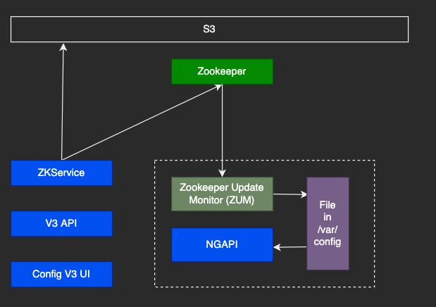
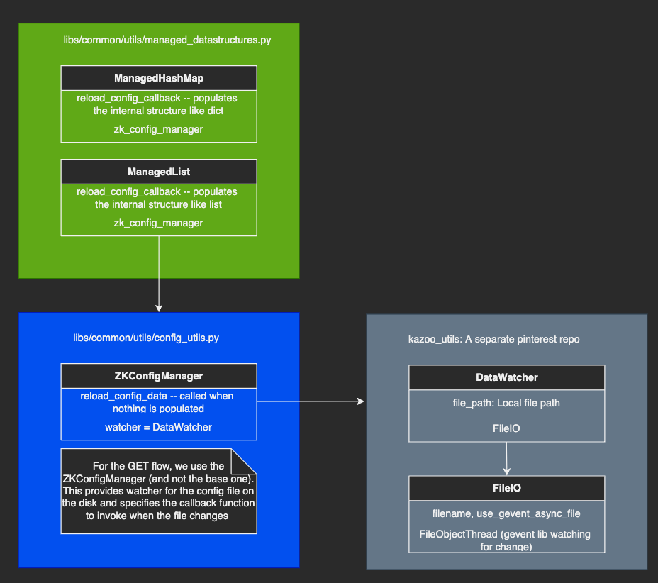

# High level Notes

- **kazoo_utils:** .venv/lib/python3.9/site-packages/kazoo_utils/__init__.py
  - Contains APIs to talk to both local file and zookeeper
  - We would need something like this for golang
  - We can use [golib filewatcher](https://github.com/johnsiilver/golib/blob/master/filewatcher/local/local.go)
  - Looks like it fetches content at each change (using [fsnotify](https://levelup.gitconnected.com/how-to-watch-for-file-change-in-golang-4d1eaa3d2964))

## High Level Managed Data Diagram
---

- Here is a high level diagram for managed data

## How does ZUM Work
- [Resources and design doc](https://w.pinadmin.com/display/~gengmao/Links+about+ZUM+-+service+discovery+and+dynamic+configurations+at+Pinterest#LinksaboutZUMservicediscoveryanddynamicconfigurationsatPinterest-Designdocs)
## How does it all work
### **GET FLOW**

- The managed_data is present on the local filesystem for each host
- This is loaded by ZUM that has a list of all the configs that it should load (check the section above for more details)
- [kazoo_utils](https://phabricator.pinadmin.com/diffusion/KZU/repository/master/)
  - This is an internal library that wraps the open source one. The only thing that is used for the **GET flow** is the `DataWatcher` and the `FileIO`

## Unanswered Questions
- Is there a use-case where the managed_data is changed and fetched in the same API request during runtime for NGAPI specifically
-

