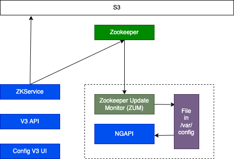

# Managed Data Notes

- **kazoo_utils:** .venv/lib/python3.9/site-packages/kazoo_utils/__init__.py
  - Contains APIs to talk to both local file and zookeeper
  - We would need something like this for golang
  - We can use [golib filewatcher](https://github.com/johnsiilver/golib/blob/master/filewatcher/local/local.go)
  - Looks like it fetches content at each change (using [fsnotify](https://levelup.gitconnected.com/how-to-watch-for-file-change-in-golang-4d1eaa3d2964))

## High Level Managed Data Diagram
---

- Here is a high level diagram for managed data

## How does it all work
- [kazoo_utils](https://phabricator.pinadmin.com/diffusion/KZU/repository/master/)
  - Internal library that wraps the open source one. This has all the details about watchers with gevents that actually fetch the data either from zk or local file system
-

